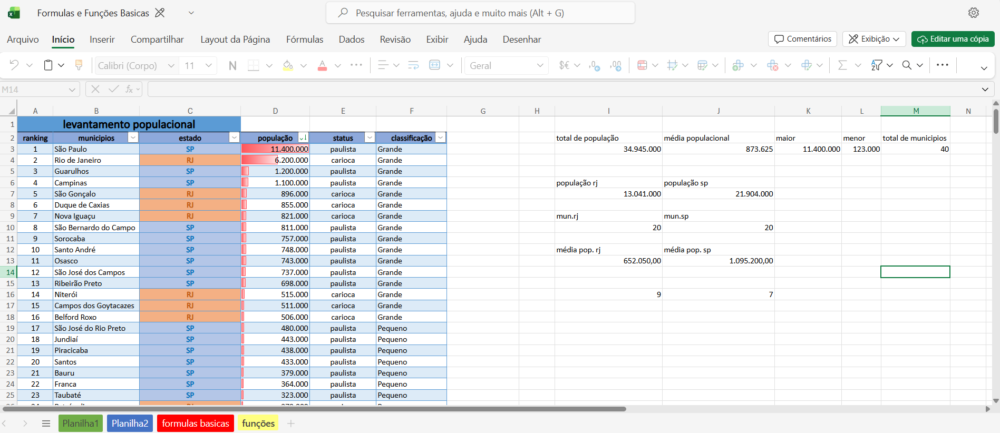

# 📚 Fórmulas e Funções Básicas

Projeto desenvolvido para estudos de Excel e LibreOffice Calc.

## 📸 Preview

## ✨ Conteúdos

- SOMA
- MÉDIA
- MAIOR e MENOR
- Fórmulas básicas
- Organização de dados

## 🛠️ Tecnologias

- Excel
- LibreOffice Calc

---
